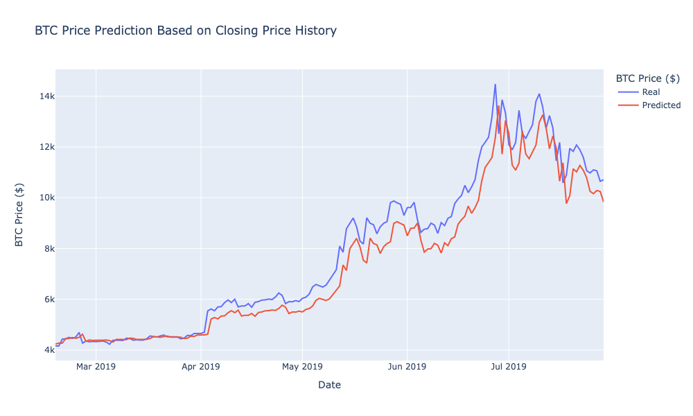
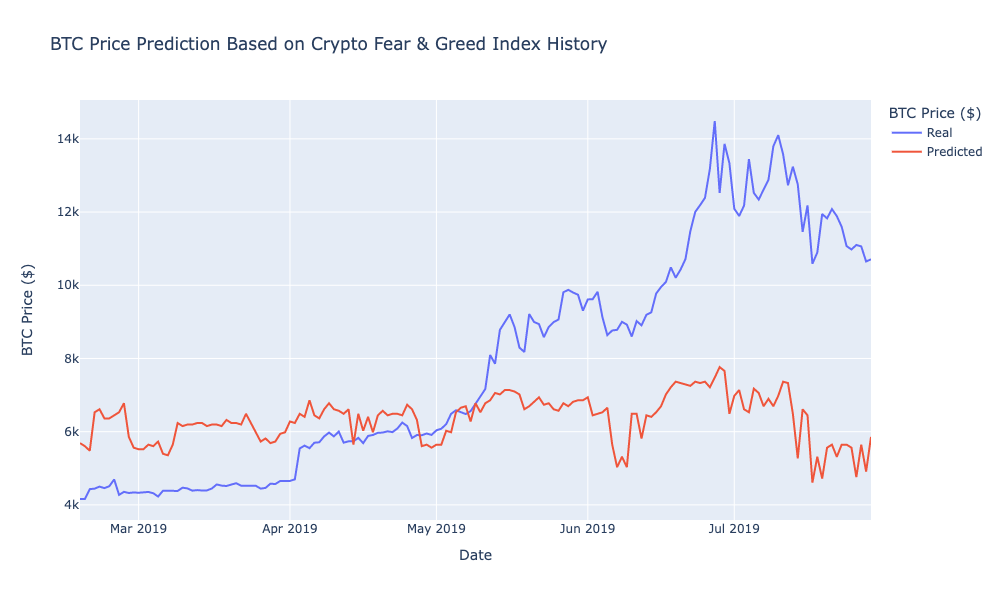

# LSTM Recurrent Neural Network Price Predictor

## Summary

With the goal of predicting price movement of Bitcoin, two LSTM RNN models will be fit to two different metrics: the closing price history of Bitcoin, and daily values of the Crypto Fear & Greed Index. This analysis evalutes the predictive performance of the same LSTM RNN model using these two separate metrics as inputs.

## Usage

### Environment

Requires an [Anaconda](https://www.anaconda.com/products/distribution) virtual environment running Python >= 3.8.

Activate your Anaconda virtual environment.
```sh
conda activate <env>
```

### Dependencies

These installations are required to run the analysis. Newer package versions can be used, but be aware that library updates may cause code errors in the notebook.

```sh
pip install numpy==1.20.3
pip install pandas==1.3.4
pip install plotly==5.8.0
pip install scikit-learn==0.24.2
pip install tensorflow==2.9.1
```

### Run

Run the program using your Jupyter Notebook editor of choice.

## Analysis Q&A

### Which model has a lower loss?

The FNG model returned a loss of `0.1258` while the Closing Price model had a loss of only `0.0068`. The Closing Price model's loss function is roughly 19 times smaller than the FNG's.

### Which model tracks the actual values better over time?

As made evident by the line charts, the Closing Price model tracks real values better over time.




### Which window size works best for the model?

A window of 1 works best for the model as it reduces the loss function and increases the speed of fitting. The tradeoff is that it's only ever predicting one day into the future. If a longer term prediction window were used, the predictions would most likely be less accurate.
